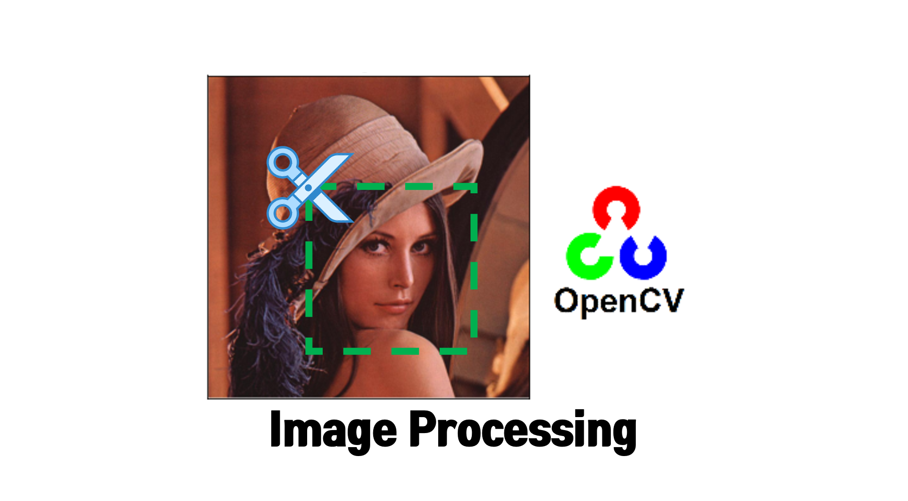

# Image Processing using OpenCV

  

### 설명 페이지

- [Basic 1 - 픽셀(Pixel)값 가져오고 설정하기](https://yunwoong.tistory.com/70) : Getting_and_Setting_Pixels.ipynb
- [Basic 2 - 기본 그리기 (선, 점, 사각형, 원)](https://yunwoong.tistory.com/71) : Drawing_with_OpenCV.ipynb
- [Basic 3 - 이미지 이동 (Shift)](https://yunwoong.tistory.com/124) : Shitf_Rotate_Filp_with_OpenCV.ipynb
- [Basic 4 - 이미지 회전 (Rotate)](https://yunwoong.tistory.com/125) : Shitf_Rotate_Filp_with_OpenCV.ipynb
- [Basic 5 - 이미지 상하, 좌우 대칭 (Flip)](https://yunwoong.tistory.com/126) : Shitf_Rotate_Filp_with_OpenCV.ipynb
- [Basic 6 - 이미지 크기조정 (Resize)](https://yunwoong.tistory.com/127) : Resize_with_OpenCV.ipynb
- [Basic 7 - 이미지 자르기 (Crop)](https://yunwoong.tistory.com/174) : Crop_with_OpenCV.ipynb

